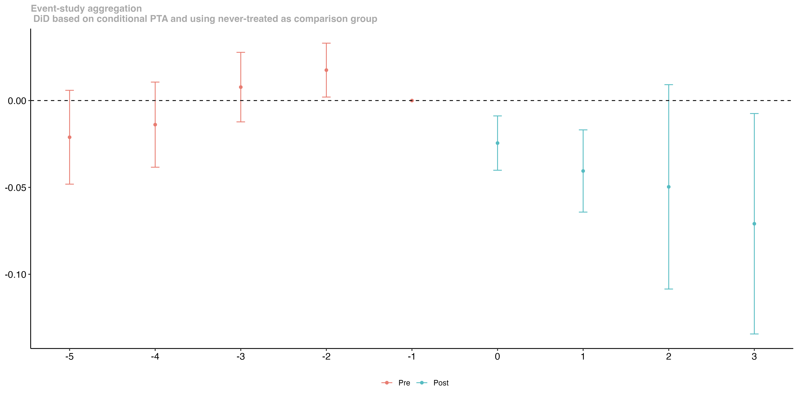
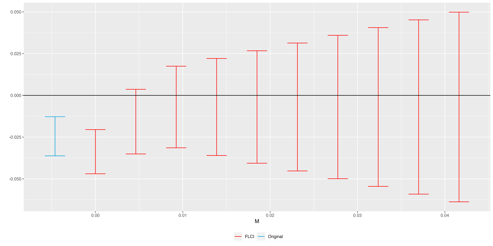

<!-- README.md is generated from README.Rmd. Please edit that file -->

```{r setup2, include = FALSE}
knitr::opts_chunk$set(
  collapse = TRUE,
  echo = TRUE,
  eval = FALSE,
  comment = "#>",
  out.width = "100%"
)
```


## Sensitivity Analysis for Heterogeneity-Robust DiD Procedures:  \n  Combining Callaway and Sant'Anna (2021) with Rambachan and Roth (2022)

The main goal of this repository is to illustrate how one can combine the heterogeneity-robust Difference-in-Differences procedures proposed by Callaway and Sant'Anna (2021) with the sensitivity analysis tools for potential violations of parallel trends proposed by Rambachan and Roth (2022). These are currently implemented in the `did` and `HonestDiD` `R` packages.


Towards that end, we will use the empirical application considered in Callaway and Sant'Anna (2021) about the effect of minimum wage on teen employment. 


Before we jump into details, let's install and load some the necessary R packages to run the example.

```{r packages,  message = FALSE, warning = FALSE, cache = TRUE, cache.lazy = TRUE, fig.width=8,fig.height=5, fig.align='center', out.width="90%", dpi = 200}
# Install some packages
library(devtools)
install_github("bcallaway11/BMisc", dependencies = TRUE)
install_github("bcallaway11/did", dependencies = TRUE)
install_github("asheshrambachan/HonestDiD", dependencies = TRUE)
#--------------------------------------------------------------------------
# Load packages
#--------------------------------------------------------------------------
# Libraries
# Load libraries
library(ggplot2)
library(here)
library(foreign)
library(tidyverse)
library(dplyr)
library(did)
library(HonestDiD)
```

## Auxiliary functions

Since this integration is still a work-in-progress and has not yet been merged into neither the `did` nor the `HonestDiD` R packages, let's define some auxiliary functions that will help implementing it.

```{r, code = readLines("codes/honest_did.R")}
```

## Effect of Minimum Wage on Teen Employment: \n Replicating Callaway and Sant'Anna (2021)

Now, let's load the data used in Callaway and Sant'Anna (2021)
```{r load_data,  message = FALSE, warning = FALSE, cache = TRUE, cache.lazy = TRUE, fig.width=8,fig.height=5, fig.align='center', out.width="90%", dpi = 200}
# Load data used in Callaway and Sant'Anna (2021) application
min_wage <- readRDS((here("data",'min_wage_CS.rds')))
```

Now, let's compute the event-study plot using the Doubly-Robust DiD procedure of Callaway and Sant'Anna (2021) based on the ``never-treated'' comparison group. Here, we will fix the reference time period to be fixed (which differs from the original implementation of Callaway and Sant'Anna, 2021)

```{r event_study_cs,  message = FALSE, warning = FALSE, cache = TRUE, cache.lazy = TRUE, fig.width=8,fig.height=5, fig.align='center', out.width="90%", dpi = 200}
# Formula for covariates 
xformla <- ~ region + (medinc + pop ) + I(pop^2) + I(medinc^2)  + white + hs  + pov
#---------------------------------------------------------------------------
# Using covariates and DR DiD with never-treated as comparison group
# Fix the reference time periods
CS_never_cond <- did::att_gt(yname="lemp",
                             tname="year",
                             idname="countyreal",
                             gname="first.treat",
                             #xformla=~1,
                             xformla = xformla,
                             control_group="nevertreated",
                             data = min_wage,
                             panel = TRUE,
                             base_period="universal",
                             bstrap = TRUE,
                             cband = TRUE)
# Now, compute event study
CS_es_never_cond <- aggte(CS_never_cond, type = "dynamic",
                          min_e = -5, max_e = 5)
#summary(CS_es_never_cond)
# Plot event study
fig_CS <- ggdid(CS_es_never_cond,
      title = "Event-study aggregation \n DiD based on conditional PTA and using never-treated as comparison group ")

fig_CS

```
{ width=100% }
From a closing inspection of this event-study plot, one can see that a straight line with negative slope could be drawn such that it pass within the uniform confidence bands for all event-study coefficients. As so, one may be skeptical about the plausibility of the conditional paralell trends in this particular application. 


How can we tackle this concern?

## Sentitivity Analysis using Rambachan and Roth (2022)


Now, let's do the sensitivity analysis for violation of (conditional) parallel trends
```{r RR_sensitivity, message = FALSE, warning = FALSE, cache = TRUE, cache.lazy = TRUE, fig.width=8,fig.height=5, fig.align='center', out.width="90%", dpi = 200}

# code for running honest_did
hd_cs_smooth_never <- honest_did(es = CS_es_never_cond,
                           e = 0,
                           type="smoothness")
hd_cs_smooth_never


hd_cs_rm_never <- honest_did(es = CS_es_never_cond, 
                          e = 0,
                          type="relative_magnitude")
hd_cs_rm_never
# Drop 0 as that is not really allowed.
hd_cs_rm_never$robust_ci <- hd_cs_rm_never$robust_ci[-1,]

## -----------------------------------------------------------------------------
# make sensitivity analysis plots
cs_HDiD_smooth <- createSensitivityPlot(hd_cs_smooth_never$robust_ci,
                      hd_cs_smooth_never$orig_ci)
cs_HDiD_smooth

cs_HDiD_relmag <- createSensitivityPlot_relativeMagnitudes(hd_cs_rm_never$robust_ci,
                                         hd_cs_rm_never$orig_ci)

cs_HDiD_relmag

```
{ width=100% }
{ width=100% }


## Conclusion

In this repo, we have shown that it is straightforward to combine the Callaway and Sant'Anna (2021) DiD procedures implemented in the `did` package, with the sentivity analysis proposed by Rambachan and Roth (2022) implemented in the `HonestDiD` package. 

## References


* [Callaway, Brantly, and Pedro H. C. Sant'Anna. "Difference-in-differences with multiple time periods." Journal of Econometrics (2021)](https://www.sciencedirect.com/science/article/pii/S0304407620303948).


* [Rambachan, Ashesh, and Jonathan Roth. "A More Credible Approach to Parallel Trends." Forthcoming at the Review of Economic Studies (2022).](https://jonathandroth.github.io/assets/files/HonestParallelTrends_Main.pdf)

